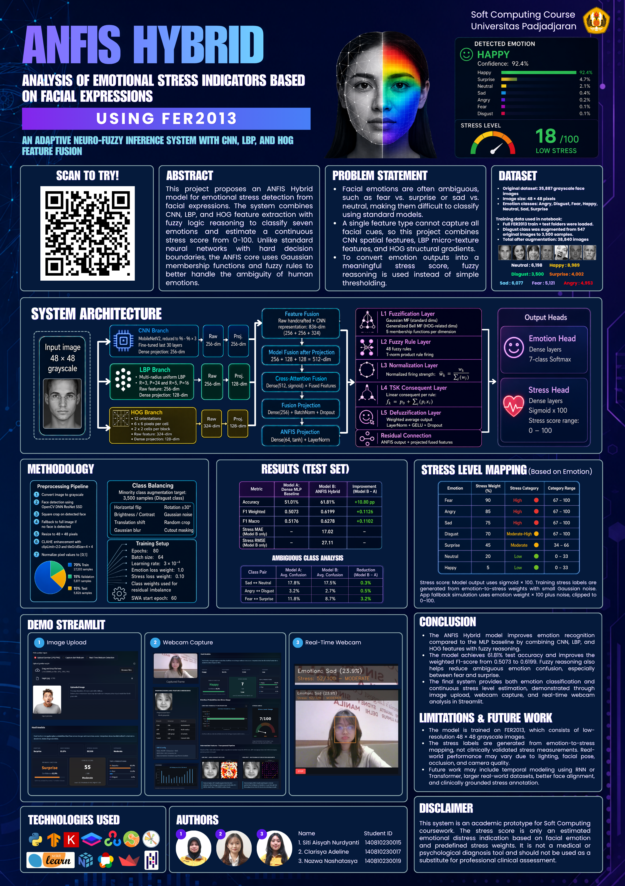

# Panduan Penggunaan Aplikasi Facial Expression Distress Analysis

Panduan ini menjelaskan cara menggunakan aplikasi **ANFIS Hybrid Facial Emotion and Stress Analyzer** untuk menganalisis ekspresi wajah dan memperkirakan tingkat emotional distress secara demonstratif.

## Link Aplikasi

Aplikasi dapat diakses melalui Streamlit Community Cloud:

https://facial-expression-distress-analysis.streamlit.app/

## Dataset

Dataset yang digunakan adalah **FER2013** dari Kaggle:

https://www.kaggle.com/datasets/msambare/fer2013

FER2013 berisi citra wajah grayscale berukuran 48 x 48 piksel dengan 7 kelas emosi:

- Angry
- Disgust
- Fear
- Happy
- Neutral
- Sad
- Surprise

## Ringkasan Aplikasi

Aplikasi ini menerima input wajah melalui gambar atau kamera, lalu melakukan:

1. Deteksi wajah.
2. Preprocessing citra wajah.
3. Ekstraksi fitur CNN, LBP, dan HOG.
4. Prediksi emosi wajah.
5. Estimasi skor distress dalam rentang 0 sampai 100.
6. Visualisasi probabilitas emosi, stress gauge, LBP map, HOG map, dan ringkasan fitur.

## Cara Menggunakan Aplikasi Online

1. Buka aplikasi:

   https://facial-expression-distress-analysis.streamlit.app/

2. Tunggu sampai halaman Streamlit selesai dimuat.

3. Pilih salah satu mode input yang tersedia:

   - **Upload Image** untuk mengunggah gambar wajah.
   - **Webcam Capture** untuk mengambil satu foto melalui kamera.
   - **Real-Time Webcam** untuk analisis langsung dari kamera secara frame-by-frame.

4. Jalankan analisis sesuai mode yang dipilih.

5. Baca hasil prediksi pada dashboard aplikasi.

## Mode Upload Image

Gunakan mode ini jika ingin menganalisis gambar dari perangkat.

Langkah penggunaan:

1. Pilih mode **Upload Image**.
2. Unggah file gambar dengan format JPG, JPEG, atau PNG.
3. Pastikan gambar memuat wajah yang cukup jelas.
4. Tunggu proses analisis selesai.
5. Lihat hasil emosi, confidence, skor distress, serta visualisasi fitur.

Tips input:

- Gunakan gambar dengan pencahayaan cukup.
- Hindari wajah yang terlalu kecil, miring ekstrem, atau tertutup objek.
- Gambar dengan satu wajah utama akan lebih mudah dianalisis.

## Mode Webcam Capture

Gunakan mode ini untuk mengambil satu gambar dari kamera.

Langkah penggunaan:

1. Pilih mode **Webcam Capture**.
2. Berikan izin kamera pada browser jika diminta.
3. Posisikan wajah di tengah kamera.
4. Ambil foto melalui komponen kamera Streamlit.
5. Tunggu hasil analisis muncul di dashboard.

## Mode Real-Time Webcam

Gunakan mode ini untuk analisis langsung melalui kamera.

Langkah penggunaan:

1. Pilih mode **Real-Time Webcam**.
2. Berikan izin kamera pada browser.
3. Posisikan wajah di area kamera.
4. Perhatikan overlay hasil prediksi yang muncul pada frame kamera.
5. Gunakan slider ukuran tampilan jika ingin memperbesar atau memperkecil video.

Output real-time menampilkan:

- Bounding box wajah.
- Label emosi.
- Confidence prediksi.
- Skor distress.
- Kategori distress.

Aplikasi sudah memakai beberapa STUN server agar koneksi WebRTC di Streamlit Cloud lebih mudah tersambung. Jika jaringan tertentu masih menampilkan pesan koneksi lama, tambahkan konfigurasi TURN pribadi di Streamlit secrets:

```toml
[webrtc]
turn_url = "turn:your-turn-server:3478"
turn_username = "username"
turn_credential = "credential"
```

## Membaca Hasil Analisis

### Emotion Prediction

Bagian ini menampilkan emosi utama yang diprediksi model, misalnya:

- Happy
- Sad
- Angry
- Fear
- Neutral
- Surprise
- Disgust

Confidence menunjukkan tingkat keyakinan model terhadap prediksi tersebut.

### Top 3 Predictions

Bagian ini menampilkan tiga kelas emosi dengan probabilitas tertinggi. Fitur ini membantu melihat apakah model memiliki prediksi yang kuat atau masih ambigu di antara beberapa kelas.

### Stress Score

Skor distress ditampilkan dalam rentang:

```text
0 sampai 100
```

Kategori yang digunakan:

| Rentang Skor | Kategori |
| --- | --- |
| 0-33 | Low |
| 34-66 | Moderate |
| 67-100 | High |

Skor ini adalah estimasi berbasis ekspresi wajah, bukan diagnosis klinis.

### Probability Chart

Chart ini memperlihatkan distribusi probabilitas untuk semua kelas emosi. Semakin panjang bar suatu emosi, semakin besar probabilitas yang diberikan model.

### Stress Gauge

Gauge menunjukkan posisi skor distress pada skala rendah, sedang, atau tinggi.

### LBP Map dan HOG Map

Visualisasi ini memperlihatkan fitur tekstur dan struktur wajah yang digunakan dalam pipeline analisis:

- **LBP Map** menangkap pola tekstur lokal pada wajah.
- **HOG Map** menangkap arah gradien dan struktur bentuk wajah.

## Cara Menjalankan Secara Lokal

Jika ingin menjalankan aplikasi dari folder proyek:

1. Masuk ke folder proyek:

   ```bash
   cd softcomp/ProjekAkhir/Streamlit/facial-expression-distress-analysis
   ```

2. Install dependency:

   ```bash
   pip install -r requirements.txt
   ```

3. Jalankan Streamlit:

   ```bash
   streamlit run app.py
   ```

4. Buka URL lokal yang muncul, biasanya:

   ```text
   http://localhost:8501
   ```

## File Penting

| File | Fungsi |
| --- | --- |
| `app.py` | File utama aplikasi Streamlit. |
| `README.md` | Dokumentasi proyek. |
| `Panduan.md` | Panduan penggunaan aplikasi. |
| `requirements.txt` | Daftar dependency Python. |
| `runtime.txt` | Versi Python untuk deployment Streamlit. |
| `anfis_emotion_model.weights.h5` | Bobot model ANFIS Hybrid. |
| `deploy.prototxt` | Arsitektur face detector OpenCV DNN. |
| `res10_300x300_ssd_iter_140000.caffemodel` | Bobot face detector OpenCV DNN. |
| `poster/1.png` | Poster proyek. |

## Catatan Penting

- Aplikasi ini dibuat sebagai prototipe akademik untuk mata kuliah Soft Computing.
- Hasil distress adalah estimasi berbasis ekspresi wajah dan pemetaan model.
- Aplikasi ini bukan alat diagnosis medis atau psikologis.
- Jangan gunakan hasil aplikasi untuk keputusan klinis, psikologis, rekrutmen, disipliner, atau keputusan penting lain.
- Akurasi dapat dipengaruhi oleh pencahayaan, kualitas kamera, pose kepala, ekspresi ambigu, kacamata, masker, dan keterbatasan dataset FER2013.

## Poster Proyek



Poster proyek tersedia di:

```text
poster/1.png
```

Poster juga sudah ditampilkan pada `README.md`.
